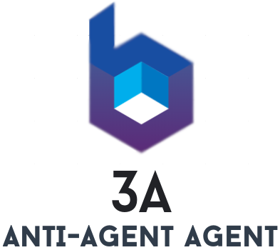

  

# Anti-Agent-Agent
A java agent with the main purpose of preventing other agents by cleaning their transform methods. 
We have the agent, now it's your job to make sure your users use it. I suggest adding a custom transformer 
that must process your program's classes in order for it to work.  

## Contributing
Pull requests are welcome. For major changes, please open an issue first to discuss what you would like to change and the reason of it.

